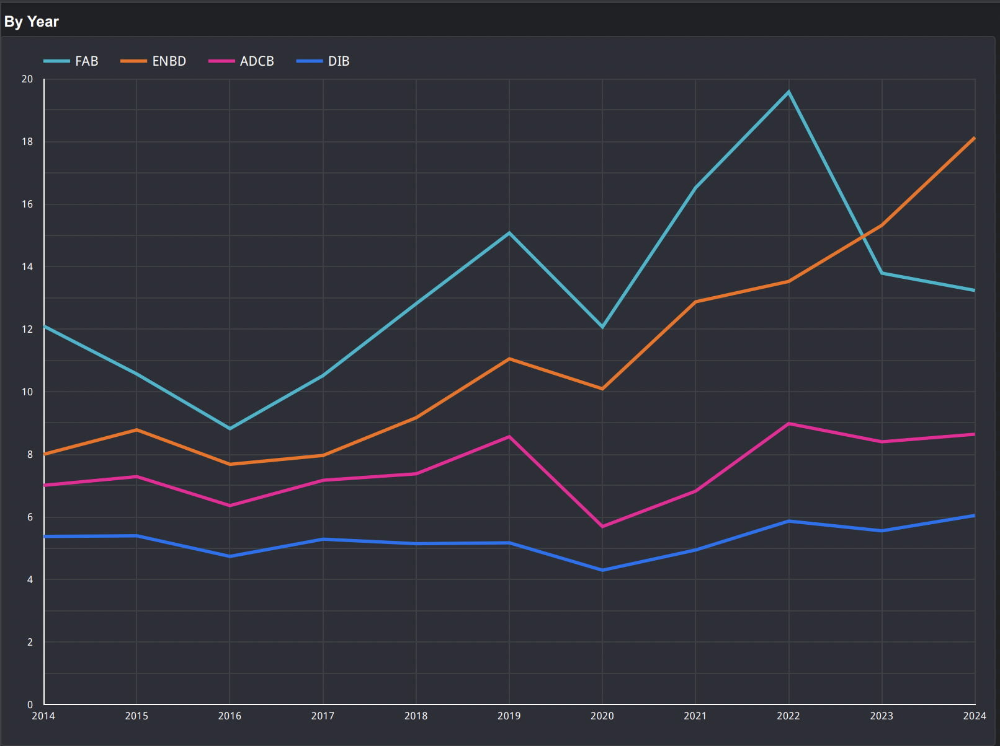
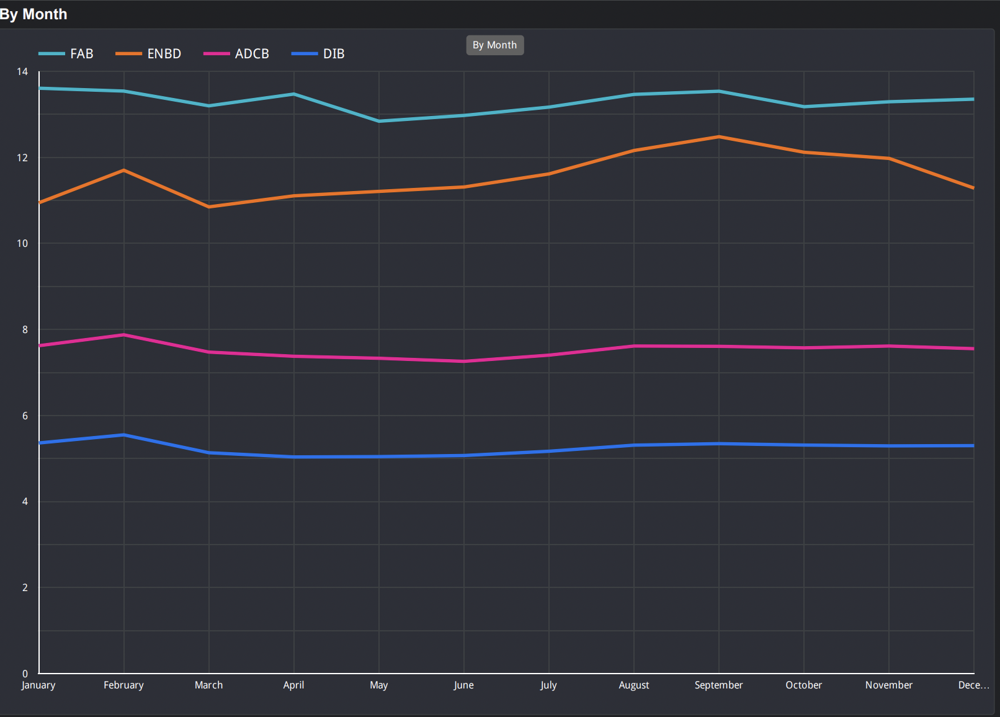
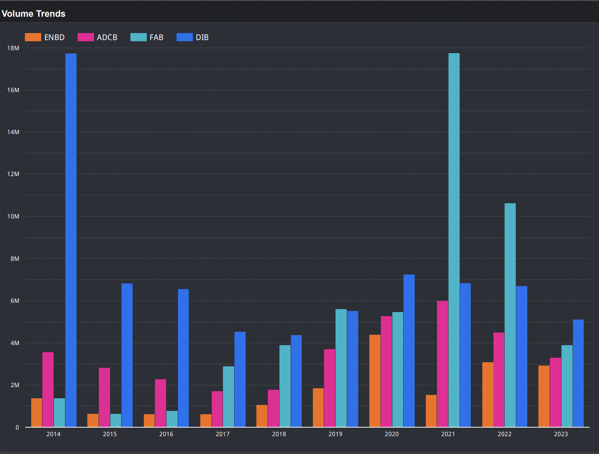
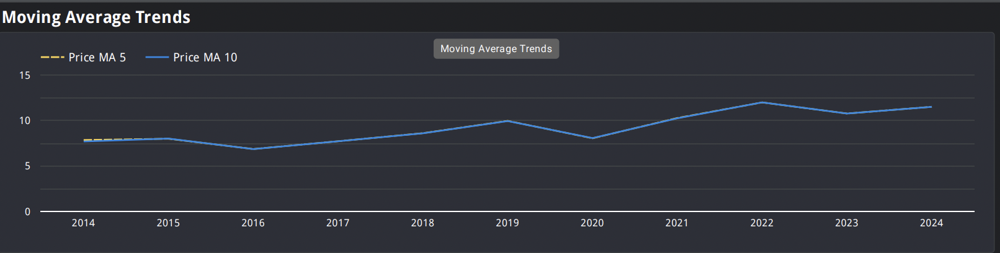
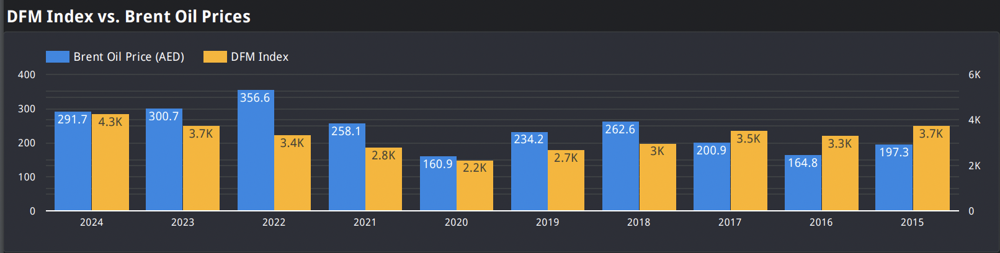
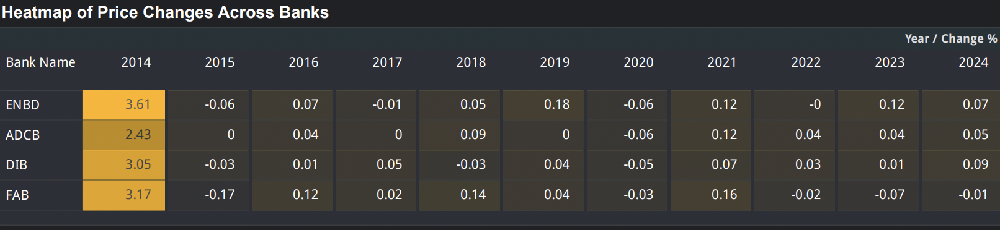
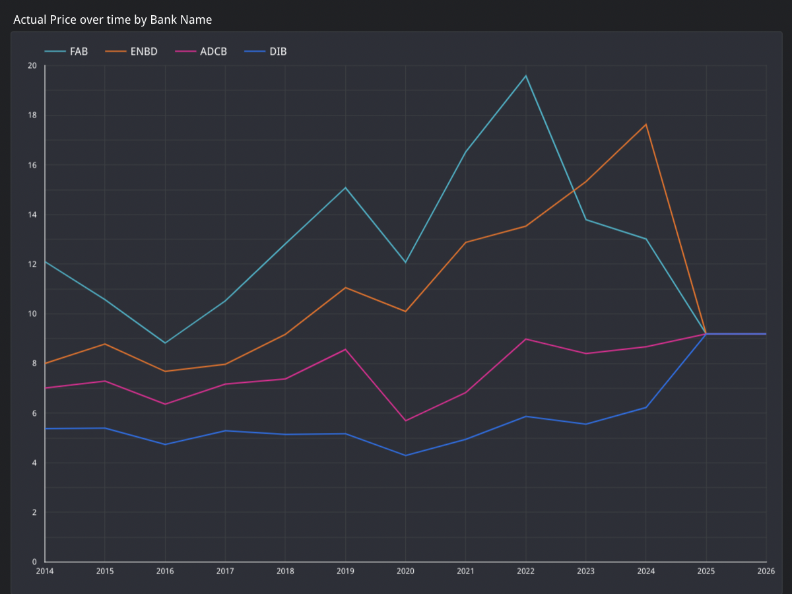
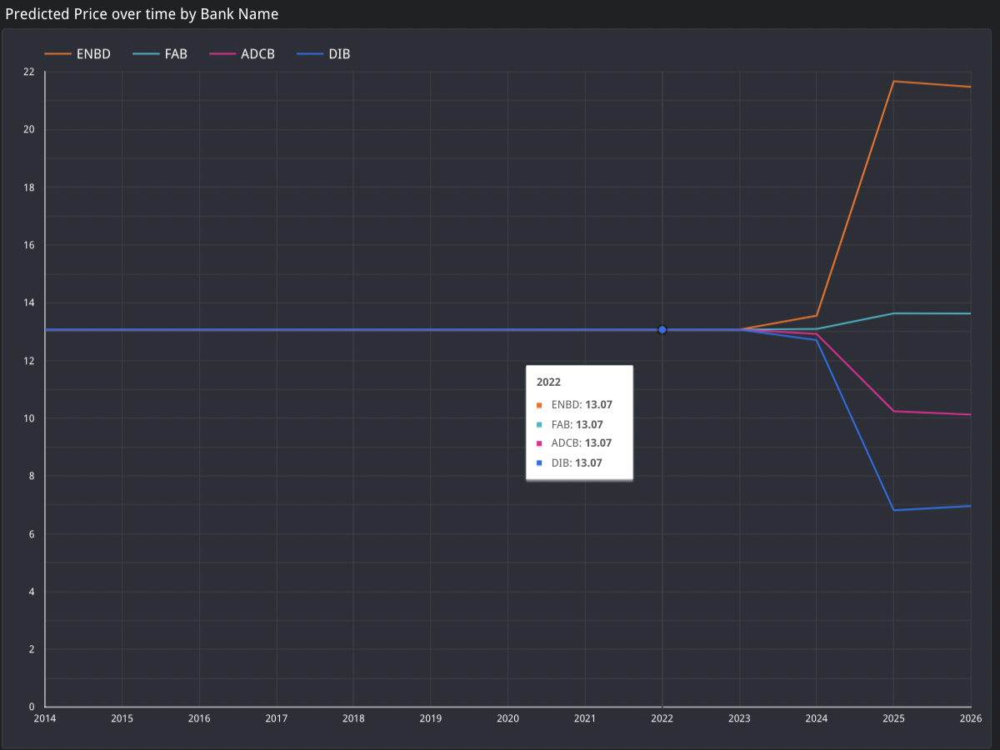

### **BIG4 UAE Banks: Forecasting Stock Prices with Machine Learning**

---

### **Introduction:**
The UAE banking sector is a dynamic and integral component of the nation's economy. This project focuses on analyzing and forecasting stock prices for four major banks — Emirates NBD (ENBD), Dubai Islamic Bank (DIB), First Abu Dhabi Bank (FAB), and Abu Dhabi Commercial Bank (ADCB). By integrating historical stock data with macroeconomic indicators and leveraging machine learning, we aim to uncover trends, insights, and actionable predictions for the future.

This repository combines rigorous data preprocessing, advanced feature engineering, and Random Forest-based modeling to predict stock prices with precision.

---

### **Data Collection and Integration**
The journey began with collecting historical stock price data from reliable sources for each bank. Additionally, macroeconomic indicators such as the DFM Index, Brent Oil prices, USD to AED exchange rates, and GDP figures were incorporated to provide a holistic view of the market.

**Steps:**
1. Individual stock price datasets were loaded and labeled with their respective bank names.
2. External datasets, including oil prices, exchange rates, and GDP data, were collected to enhance the dataset with meaningful features.

---

### **Data Preprocessing**
Preprocessing involved transforming raw datasets into a format suitable for modeling while handling missing values and standardizing features. Key steps included:

1. **Combining Stock Data:**
   - Stock data from all four banks was consolidated into a single master dataset.
   - A `Bank Name` column was added to distinguish data across banks.

2. **Handling Missing Values:**
   - Missing values in trading volume (`Vol.`) were converted to numeric values and filled with the mean.
   - Missing values in macroeconomic indicators were forward-filled for continuity.

3. **Feature Engineering:**
   - **Lagged Features:** Created `Price Lag 1` and `Change % Lag 1` to capture past trends.
   - **Moving Averages:** Added 5-day (`Price MA 5`) and 10-day (`Price MA 10`) moving averages for smoothing.
   - **Interaction Features:** Calculated `Price per Vol` to assess price efficiency relative to trading volume.

4. **Merging Macroeconomic Data:**
   - DFM Index, Brent Oil prices (converted to AED), and GDP data were merged on a daily basis.
   - Missing GDP values were filled using forward and backward filling techniques, and expanded to daily granularity.

5. **Normalization:**
   - Numerical columns were scaled using MinMaxScaler to ensure consistent feature ranges for machine learning.

**Outcome:** A clean, feature-rich dataset ready for predictive modeling, saved as `enhanced_stock_data.csv`.

---

### **Modeling: Predicting Stock Prices with Random Forest**
Random Forest, a robust ensemble learning algorithm, was employed to predict stock prices. The modeling workflow involved:

1. **Data Encoding:**
   - The `Bank Name` column was encoded as integers to ensure compatibility with the model.

2. **Feature Selection:**
   - Selected a range of numerical features, including price-related metrics, macroeconomic indicators, and lagged values.

3. **Forecasting Approach:**
   - Separate models were trained for each bank using an 80-20 time-based train-test split.
   - Predictions were made for:
     - **Daily Forecasts:** For the next 30 days.
     - **Monthly Forecasts:** For up to 24 months.

4. **Recalibration and Restoration:**
   - Predicted prices were restored to their original scale using MinMaxScaler.
   - Predictions were recalibrated to align with the most recent actual prices.

5. **Combining Predictions:**
   - Daily and monthly forecasts were combined, labeled by `Prediction Type`, and merged with actual prices for comparative analysis.

**Outcome:** A comprehensive dataset of actual and predicted prices, saved as `combined_forecasts.csv`.

---

### **Key Insights**

#### **1. Stock Price Trends Over Time**
- **Yearly Trends:**

  - The post-2021 decline for most banks correlates with global market uncertainties, possibly influenced by economic disruptions such as the pandemic. 
  - **FAB** peaked at **AED 19.58** in 2022, reflecting its dominance in the market. However, a notable decline followed in 2023 and 2024.  
  - **ENBD** displayed consistent growth, reaching **AED 18.16** in 2024, positioning itself as a strong performer post-2020.  
  - **ADCB** and **DIB** showed modest growth, with **ADCB** averaging **AED 8.64** and **DIB** averaging **AED 6.03** in 2024, appealing to risk-averse investors.  

- **Monthly Trends:**

  - Monthly price trends were stable across all banks, highlighting limited intra-year volatility.  
  - **FAB** consistently maintained higher values, while **DIB** showed the least fluctuation over months.
 
**Yearly trends clearly depict FAB and ENBD as market leaders.**
**Monthly trends underline the consistent price stability across banks.**

#### **2. Trading Volume Analysis**
- **Volume Trends:**

  - **DIB** recorded exceptionally high trading volumes in 2014 and 2021, exceeding **17M trades per day** in 2021, showcasing its high liquidity and appeal to active traders.
  - **FAB** followed closely, with trading volumes peaking at ~**18M in 2021**, aligning with its price dominance during the same year.
  - **ENBD** and **ADCB** recorded moderate trading volumes, averaging between **3M to 5M trades per day** in recent years.
    
The **"Trade Volume Analysis by Bank"** scatter plot shows the relationship between price and trading volume, while the bar chart highlights the 2021 volume spikes, likely due to market recovery post-COVID-19.

---

#### **3. Moving Average Analysis**

- The 5-day and 10-day moving averages show a consistent upward trend from 2016 to 2021, reflecting steady growth.
- Post-2021, moving averages plateau, indicating market stabilization.

**Visualization:**  
The **"Moving Average Trends"** chart showcases how short-term (MA5) and medium-term (MA10) trends closely track each other, reflecting consistent price stability.

---

#### **4. Macroeconomic Dependencies**

- Strong correlations between the **DFM Index** and **Brent Oil prices** underline the UAE's reliance on energy markets.  
- The **DFM Index** peaked at **356.6 in 2022**, reflecting post-pandemic recovery, while **Brent Oil prices** reached **~300 AED in 2023**.

**Visualization:**  
The **"DFM Index vs. Brent Oil Prices"** bar chart vividly displays the synchronized movements of the two indicators, emphasizing the UAE economy’s dependence on oil prices.

---

#### **5. Price Changes Across Banks**

 - **ENBD** experienced consistent growth with notable spikes in **2021** and **2024**, driven by macroeconomic recovery phases.  
 - **FAB** showed a sharp increase in **2022**, followed by a dip in **2023**, reflecting market corrections.  
 - **ADCB** and **DIB** exhibited minimal year-on-year price changes, reinforcing their stability for conservative investors.

**Visualization:**  
The **"Heatmap of Price Changes Across Banks"** highlights the variability in price changes, with ENBD showing more dynamic movement compared to its peers.

---

#### **6. Actual vs. Predicted Prices**

- **Predicted Trends:**
  - Predictions for daily prices align closely with actual trends, showcasing the model's short-term accuracy.
  - Monthly forecasts, however, deviate significantly for ENBD post-2024, suggesting the need for improved long-term modeling techniques.
- **Residual Analysis:**
  - Absolute errors are higher for monthly forecasts, particularly for FAB and ENBD, reflecting their higher volatility.

**Visualization:**  
The **"Actual vs. Predicted Prices Over Time"** chart compares historical and forecasted prices, highlighting the model's strengths and weaknesses. The **"Absolute Error by Forecast Type and Bank Name"** bar chart emphasizes the challenges in long-term forecasting.

---

### **Challenges and Future Directions**
1. **Data Quality:** Managing missing values in external datasets and aligning them with stock data posed challenges.
2. **Model Refinement:** Monthly forecasts require additional tuning to reduce variance.
3. **Market Dynamics:** Incorporating sentiment analysis or news data could enhance prediction accuracy.

---

### **Conclusion**
This project offers a robust framework for analyzing and forecasting stock prices in the UAE banking sector. By integrating market trends, macroeconomic factors, and machine learning, it provides valuable insights for investors and policymakers alike.

